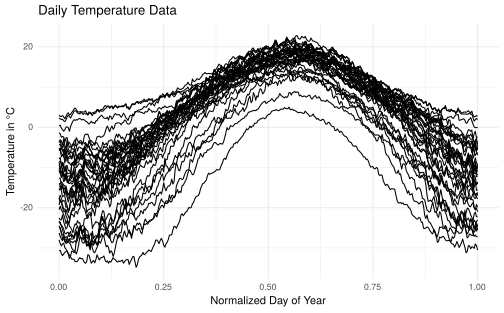
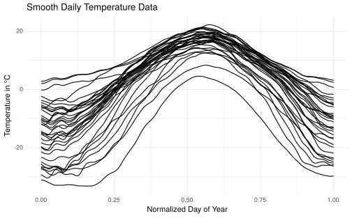
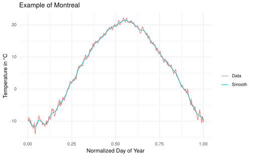
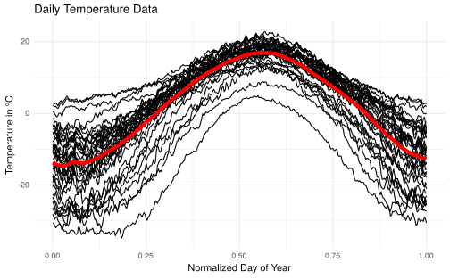
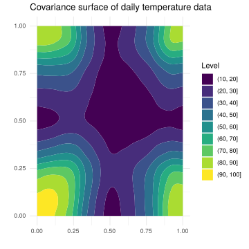

<!-- README.md is generated from README.Rmd/ Please edit that file -->

# denoisr

<!-- badges: start -->

[](https://travis-ci.org/StevenGolovkine/denoisr)
[](https://www.codacy.com/manual/StevenGolovkine/denoisr?utm_source=github.com&utm_medium=referral&utm_content=StevenGolovkine/denoisr&utm_campaign=Badge_Grade)
[](https://zenodo.org/badge/latestdoi/215247523)

<!-- badges: end -->

## Overview

`denoisr` is a non-parametric smoother for noisy curve data, providing
different functions to estimate various parameters:

  - `estimate_H0_list()` and `estimate_H0_deriv_list()` estimate the
    smoothness of the curves.
  - `estimate_b_list()` and `estimate_bandwidth()` estimate the
    bandwidth used in the Nadaraya-Watson estimator.
  - `estimate_curve()` estimates one curve, given bandwidths.
  - `smooth_curves()` and `smooth_curves_regularity()` estimate the
    curves.
  - `estimate_mean()` and `estimate_covariance()` estimate the
    leave-one-out smoothing mean and covariance.

You can learn more about thm in `vignette('denoisr')`.

## Installation

The package is not yet on CRAN. But, you can install from source
with

``` r
devtools::install_url("https://github.com/StevenGolovkine/denoisr/raw/master/denoisr_1.0.2.tar.gz")
```

## Development version

You can install the last released version of `denoisr` from
[Github](https://github.com/StevenGolovkine/denoisr) with:

``` r
devtools::install_github("StevenGolovkine/denoisr")
```

## Usage

``` r
# Load packages
library(denoisr)
library(dplyr)
library(funData)
library(ggplot2)
library(reshape2)
```

``` r
# Load data
data("canadian_temperature_daily")
```

``` r
# Convert list to funData object
data_fd <- list2funData(canadian_temperature_daily)
```

``` r
# Plot of the data
autoplot(data_fd) + 
  labs(title = 'Daily Temperature Data',
       x = 'Normalized Day of Year',
       y = 'Temperature in °C') +
  theme_minimal()
```



``` r
# Smooth the data
smooth_data <- smooth_curves(canadian_temperature_daily, 
                             t0_list = 0.5, 
                             k0_list = 5)
```

``` r
# Plot of the smoothed data
smooth_data_fd <- list2funData(smooth_data$smooth)
autoplot(smooth_data_fd) +
  labs(title = 'Smooth Daily Temperature Data',
       x = 'Normalized Day of Year',
       y = 'Temperature in °C') +
  theme_minimal()
```



``` r
# Plot one realisation of the smoothed data
montreal <- tibble(t = canadian_temperature_daily$Montreal$t,
                   Data = canadian_temperature_daily$Montreal$x,
                   Smooth = smooth_data$smooth$Montreal$x) %>% 
  reshape2::melt(id = 't')
ggplot(montreal, aes(x = t, y = value, color = variable)) +
  geom_line() +
  labs(title = 'Example of Montreal',
       x = 'Normalized Day of Year',
       y = 'Temperature in °C',
       color = '') +
  theme_minimal()
```



``` r
# Compute the mean curve
mean_curve <- estimate_mean(canadian_temperature_daily,
                            U = seq(0, 1, length.out = 501),
                            b = smooth_data$parameter$b)
```

``` r
mean_curve_plot <- tibble(t = seq(0, 1, length.out = 501), x = mean_curve)
autoplot(data_fd) +
  geom_line(data = mean_curve_plot, mapping = aes(x = t, y = x, group = NULL), col = 'red', size = 2) +
  labs(title = 'Daily Temperature Data',
       x = 'Normalized Day of Year',
       y = 'Temperature in °C') +
  theme_minimal()
```



``` r
# Compute the covariance surface
U <- seq(0, 1, length.out = 101)
cov_surface <- estimate_covariance(canadian_temperature_daily,
                                   U = U,
                                   b = smooth_data$parameter$b,
                                   h = 0.05)
```

``` r
cov_surface_plot <- tibble(expand.grid(U, U), C = as.vector(cov_surface))
ggplot(cov_surface_plot) + 
  geom_contour_filled(aes(x = Var1, y = Var2, z = C)) + 
  labs(title = 'Covariance surface of daily temperature data',
       x = '',
       y = '',
       fill = 'Level') +
  theme_minimal()
```


